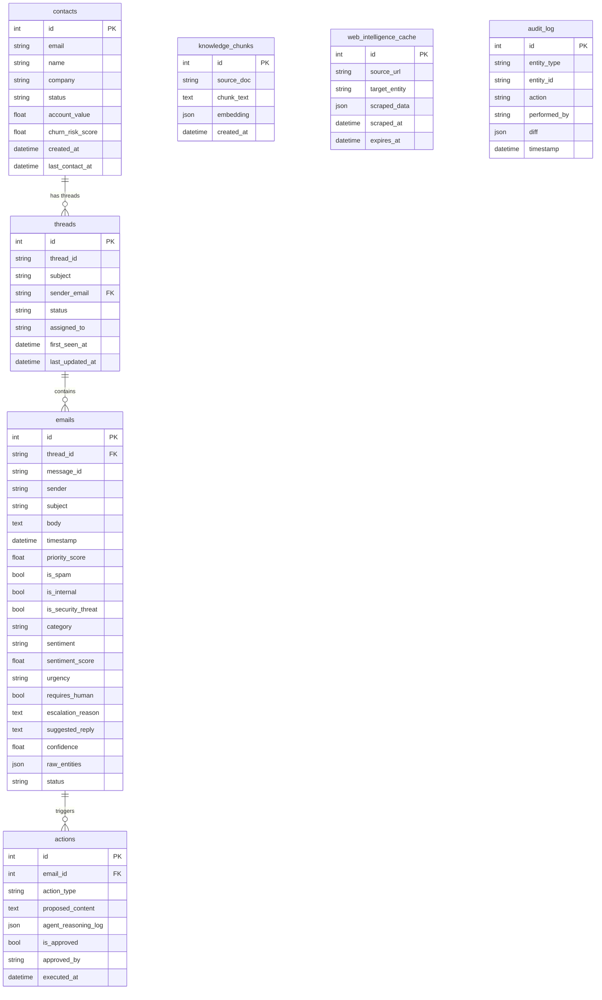

# Database ER Diagram

## Entity Relationship Diagram

## Relationship Notes

- One contact has many threads — Bob Jones has both `thread_bob_outage` and `thread_bob_api_limits`
- One thread has many emails — ordered by timestamp to give full conversation context to the LLM
- One email has many actions — each agent tool call (flag_for_legal, escalate_to_human, draft_reply) creates an action row
- `knowledge_chunks`, `web_intelligence_cache`, and `audit_log` are standalone — no foreign keys, support the intelligence pipeline